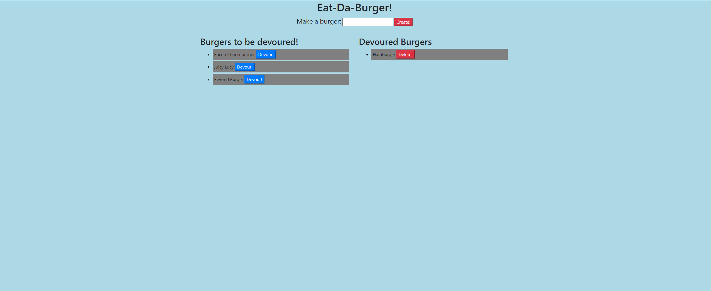

# Eat-Da-Burger

## Overview
This app uses MySQL, express, and handlebars to create your own burger and devour it. 

## Table of Contents

1. [Installation](#installation)

2. [Usage](#usage)

3. [Contributions](#contribution)

4. [Test Instructions](#test-instructions)

5. [Screenshots](#screenshots)

6. [Licenses](#licenses)

7. [Questions](#questions)

## Installation

 clone the repo from github and run 'npm install' to install the required directories

## Usage

Type your entry into the text area and click 'Create!' then it will be added to list on the left, then you can click devour!' Once you do that, it will appear on the right and can be deleted. 

## Contribution

none

## Test Instructions

none

## Screenshots

## License

    
## Questions? Contact Me!

My GitHub is [bo-stevenson](https://www.github.com/bo-stevenson).

My email is [bostevenson1027@gmail.com](mailto:bostevenson1027@gmail.com).
